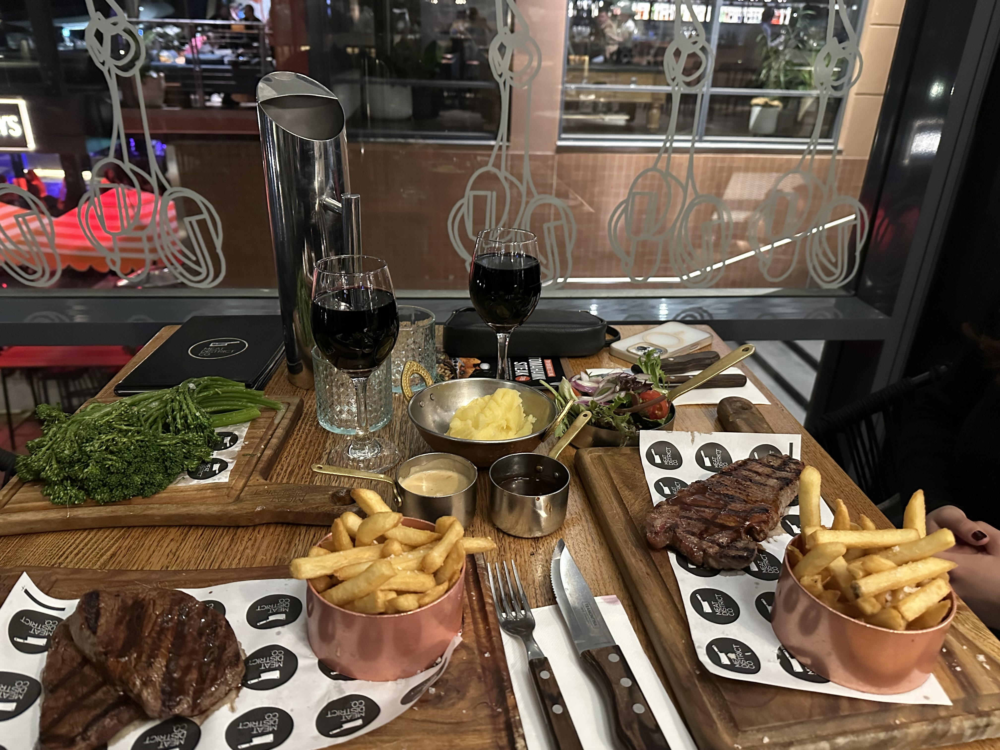

Steak with a Darling Harbour View!
Perfect location to get some drinks before and some Yo Chi after, and on Saturday like we experienced to see the fireworks!

The service was very nice, but seemed unpolished. It took a while to get our reserved table, we didn’t get a drinks menu, it took a while to order our drinks. But the food came out very quickly!

Out of our two steaks, we both agreed that the Medallion was much nicer, a lot more juicy and flavourful. The Sirloin was fattier, but not a nice fat, it was very tough and a tiny bit overcooked.

The sides were a salad or chips, with the salad being very boring and not having enough dressing but the chips were nice.

We also got the truffle mash and broccolini as well, which were both surprisingly very nice.

The highlight for both of us however was the creamy garlic sauce, which when smothered all over the sirloin made for a very nice bite. The red wine just was not a favourite.

## What we ordered:

- Truffle Mash
- Steamed Broccolini
- Medallion w/Creamy Garlic Sauce + Chips
- Sirloin w/Red Wine Jus + Side Salad

## Drinks:

- Seppelt The Drives Shiraz
